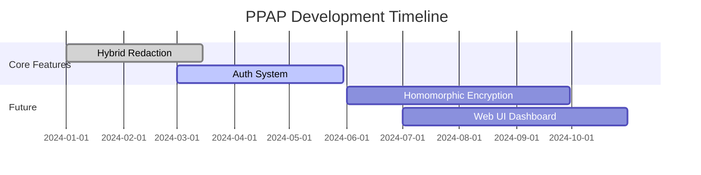

# Privacy-Preserving AI Proxy (PPAP) 🔒🤖

[](https://github.com/mamun39/PPAP)
[](https://python.org)
[](https://fastapi.tiangolo.com)

> Secure gateway for LLM interactions with intelligent privacy protection


## Why PPAP? 🛡️
As AI systems handle increasingly sensitive data, PPAP provides critical privacy safeguards by:
1. Preventing accidental PII leakage in LLM interactions
2. Offering multiple redaction strategies for different use cases
3. Maintaining usability while ensuring compliance with privacy regulations

## Key Features ✨

### **Core Capabilities**
- Hybrid PII Redaction: Combine pattern matching (Presidio) + LLM contextual analysis
- Multi-Strategy Sanitization:
  - `mask`: **** pattern replacement
  - `full`: Type-label substitution
  - `tag`: Metadata-preserving encapsulation
- Modular LLM Integration: Supports both cloud APIs and local models

### **Security Framework**
- Zero-Trust Input Sanitization
- JWT Authentication (Extended Validation)
- Rate Limiting & Request Validation
- TLS 1.3 Ready (Production Deployment)

### **Deployment Flexibility**
- Containerized microservices architecture
- Local model support via Ollama/Mistral
- Cloud-native design with Kubernetes manifests (coming Q3 2024)

## Tech Stack 🛠️

| Category       | Technologies                          |
|----------------|---------------------------------------|
| Core Framework | FastAPI, Pydantic, Python 3.10+       |
| Privacy Engine | Presidio, spaCy, Regex Patterns       |
| AI/ML          | Ollama, Mistral-7B, Transformers      |
| Security       | PyCryptodome, OAuth2, Let's Encrypt   |
| DevOps         | Poetry, Docker, GitHub Actions, Prometheus |

## Getting Started 🚀

### Quick Install (Development)
```bash
git clone git@github.com:mamun39/PPAP.git && cd PPAP
python -m venv .venv && source .venv/bin/activate
poetry install --with dev
uvicorn app.main:app --reload
```

### Production Deployment
```bash
docker compose -f docker-compose.prod.yml up --build
```

## API Endpoints 📡

| Endpoint         | Method | Description                     |
|------------------|--------|---------------------------------|
| `/sanitize`      | POST   | Core redaction endpoint         |
| `/healthcheck`   | GET    | Service status monitoring       |
| `/metrics`       | GET    | Prometheus metrics endpoint     |

**Example Request:**
```bash
curl -X POST "http://localhost:8000/sanitize" \
  -H "Content-Type: application/json" \
  -d '{
    "text": "Contact me at john@example.com or 555-1234",
    "redaction_style": "tag"
  }'
```

**Response:**
```json
{
  "sanitized_text": "Contact me at [EMAIL:john@example.com] or [PHONE:555-1234]",
  "redaction_stats": {
    "pii_count": 2,
    "redaction_time_ms": 42
  }
}
```

## Advanced Configuration ⚙️

### Redaction Strategies
```yaml
# config/redaction_profiles.yaml
profiles:
  strict:
    styles: [mask, full]
    models: [presidio, llm]
  lenient: 
    styles: [tag]
    models: [presidio]
```

### LLM Model Management
```bash
# List available models
./scripts/model_manager.sh list

# Start with specific model
./scripts/run_fastapi.sh -r llm -m mistral:7b-instruct
```

## Roadmap 🗺️



## Security Advisories ⚠️

**Current Limitations:**
```python
# Contextual recognition challenge example
input_text = "Book flight to New York"
redacted_text = redactor.redact(input_text)  # Returns "Book flight to [LOCATION]"
```

**Recommended Mitigations:**
1. Always combine LLM redactor with pattern-based approaches
2. Implement allow-lists for non-sensitive proper nouns
3. Use strict redaction for healthcare/financial data

## Contributing 🤝
We welcome contributions! Please review our:
- [Contribution Guidelines](CONTRIBUTING.md)
- [Code of Conduct](CODE_OF_CONDUCT.md)
- [Good First Issues](https://github.com/mamun39/PPAP/issues?q=is%3Aopen+is%3Aissue+label%3A%22good+first+issue%22)

## License 📜
This project is licensed under the [Business Source License 1.1](LICENSE). Contact mamun39@proton.me for commercial use inquiries.